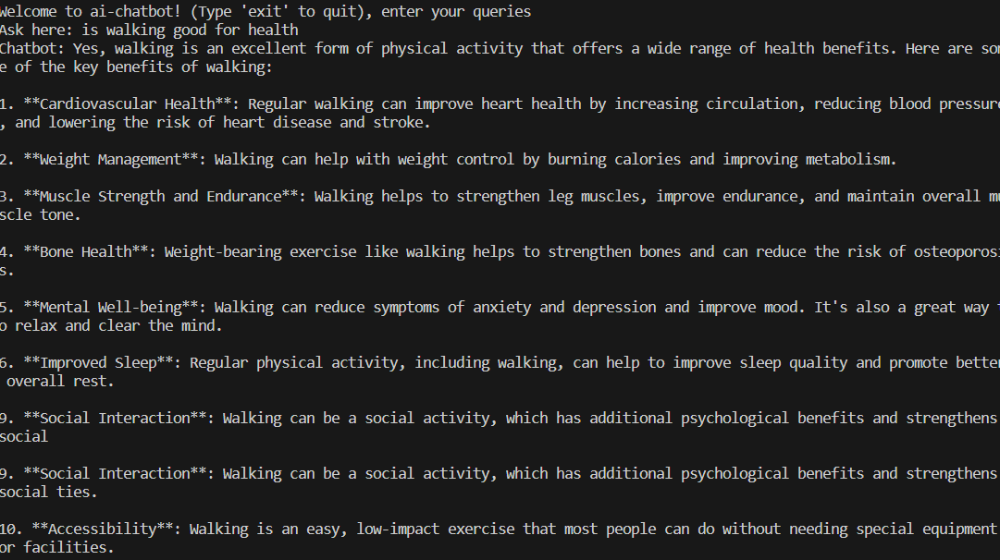

# Welcome to The AI learnings

#### ai-chatbot with user prompt 

* Creating a chatbot with openai keys
* Learn and build AI tools that solve real problems
* lets turn our coding skills into actionable solutions

## Steps to craete the code 
- Always try to create a python virtual environment while building your code as it helps to avoid issues while installing libraries of our required version
- lets create a virtual environment for the ai-chatbot
  * open a terminal in visual studio code 
  * type - python -m venv promptapp c:\Users\folderlocation  (promptapp is the virtual environment name)
  * promptapp\Scripts\activate - This will activate the virtual env
- Check the promptapp.py file where it is taking user input; Ask here:

